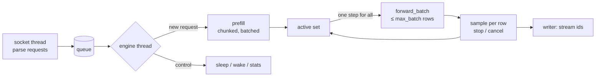

# Architecture

Eke Hive is two processes in one container:

```
 client ──HTTP──▶ server/hive_server.py ──Unix socket, JSON lines──▶ hived / hived_glm ──▶ GPU · CPU pool · RAM · NVMe
                  (chat template, tools,      (token ids in,           (engine/)
                   images, sessions)           token ids out)
```

- **`hived`** (`engine/src/hived.cpp`) is the C++/CUDA engine daemon. It only deals in token ids: it loads the
  model, schedules requests, runs prefill and decode, samples, and streams ids back. The same source is built twice: `hived`
  for DeepSeek-V4.1-Flash and `hived_glm` for GLM-5.3-Flash, which swaps in the GLM model, expert store and runtime
  (`engine/src/glm/`, `engine/include/hive/glm/hived_family.h`). Scheduling, sessions, prefix reuse, the speculative-decoding
  gate, sampling, sleep and the socket protocol are shared. The launcher picks the build from the checkpoint's `model_type`.
- **`hive_server.py`** is the HTTP API server (chat-completions and messages endpoints). It turns chat requests into token ids
  with the model's own encoding code (DeepSeek: the checkpoint's `encoding/`; GLM: its `chat_template.jinja` plus
  `server/families/glm.py`) and turns ids back into text, reasoning and tool calls.
- **`hive`** (`engine/src/hive_main.cpp`) is a DeepSeek CLI over the same runtime for single runs, layer dumps and the
  validation modes described in [validation.md](validation.md).
- **The oracle** (`oracle/dsv41_oracle.py`) is a CPU golden model of DeepSeek used only for validation; GLM is checked against
  the transformers implementation (`glm_check`, [glm.md](glm.md#correctness)).

The engine is written for two models. **DeepSeek-V4.1-Flash**: 40 transformer layers with compressed-KV attention
and a sparse indexer, hyper-connections (HC, mixed with Sinkhorn), routed MoE experts in MXFP4, shared experts,
Engram lookup tables at layers 1 and 14, and a three-stage MTP draft head ("DSpark"). The numerical contract is
the reference implementation shipped in the checkpoint (`inference/model.py`, `inference/kernel.py`).
**GLM-5.3-Flash**: 45 layers — 34 linear-attention (KDA) and 11 DSA sparse-attention layers — with hyper-connections, routed
experts in NVFP4, a NextN draft layer and a vision encoder; it is summarised in [GLM-5.3-Flash](#glm-53-flash) below and
described in full in [glm.md](glm.md).

The sections from "Data placement" to "API server" describe the DeepSeek path, which came first; where GLM shares a
mechanism it says so, and GLM's own design is in the last section.

## Data placement

The routed experts (~296 GB in the checkpoint) and the Engram tables (~203 GB) do not fit in 96 GB of VRAM.
Everything is placed by how often it is touched:

| Tier | What lives there |
| --- | --- |
| **VRAM** | Dense weights (FP8, block scales expanded per row), MTP stages, the KV/indexer state of a pre-allocated session pool, work buffers, staging slots for copied experts, and a slot cache of the hottest experts (`--vram-cache-mb`, or "free VRAM − reserve" with `HIVE_CACHE_FIT`) |
| **RAM** | Pinned: every routed expert (layers 0–39 and the three MTP stages), the Engram tables, the embedding table. Also archived sessions and prompt checkpoints |
| **NVMe** | The checkpoint. Read once at start; in SSD mode (`HIVE_ENGRAM_SSD=1`) the ~195 GB Engram value tables stay here and rows are read on demand |

### Expert records and the NUMA row split

An expert is stored as one **record**: `w1`, its scales, `w3`, its scales, `w2`, its scales — e2m1 weights with
ue8m0 scales per 32-element block, 4 KiB aligned, about 18.8 MB (17.9 MiB) per expert. The GPU format (staging
slots, cache slots) is the whole record.

In RAM every record is split **by rows** across the two NUMA nodes: node 0 holds the first half of the rows of
each matrix (and their scales), node 1 the second half, each half laid out like a smaller record (~9.4 MB).

```
 GPU record (VRAM slot)        RAM, NUMA node 0          RAM, NUMA node 1
 ┌──────────────────────┐      ┌──────────────────┐      ┌──────────────────┐
 │ w1 rows 0..I         │ ◀──  │ w1 rows 0..I/2   │      │ w1 rows I/2..I   │
 │ s1                   │      │ s1  "            │      │ s1  "            │
 │ w3 rows 0..I         │      │ w3 rows 0..I/2   │      │ w3 rows I/2..I   │
 │ s3                   │      │ s3  "            │      │ s3  "            │
 │ w2 rows 0..D         │      │ w2 rows 0..D/2   │      │ w2 rows D/2..D   │
 │ s2                   │      │ s2  "            │      │ s2  "            │
 └──────────────────────┘      └──────────────────┘      └──────────────────┘
        H2D = several contiguous pieces from both halves (byte-identical result)
```

Why: a CPU-computed expert is bound by DRAM bandwidth. With whole records placed on alternating nodes, one miss
was limited to a single node's bandwidth; with the row split, every job runs on both nodes at once, each node's
workers reading local memory.

### Session state

A session holds the attention window ring, the compressed KV, the indexer key cache and the compressor state.
Compressed KV and indexer keys are stored packed as fp4 nibbles plus scales (a compressed-KV row is 288 bytes
instead of 1,024; an index key 80 bytes instead of 256). Unpacked, the values are bit-identical to the fp4-rounded
bf16 values the reference keeps, so attention and the indexer unpack them inside the kernels. The KV of
`--max-sessions` sessions is allocated at start and reused, so VRAM use peaks right after start-up.

### Loading

With `HIVE_LOAD_PAR` and `HIVE_LOAD_PREFAULT` (both on in the recommended configuration):

1. A background thread pre-reads the dense tensors into the page cache while the model is constructed, and the
   expert/Engram arenas are faulted in on other threads at the same time.
2. All expert layers and both Engram tables are read in one parallel O_DIRECT pass (aligned chunks, bounce
   buffers, copy into place) while the memory is registered as pinned.
3. The checkpoint's page cache is released, the session pool and cache slots are allocated, and the experts
   that were resident in the previous run (warm-start file, saved every 60 s) are loaded first.

## The daemon



- **Scheduler.** New requests are prefilled (in chunks) and join the active set; each decode step runs every
  active sequence as one row of `forward_batch`, with per-row sampling, stop and cancellation. Active sessions
  are never evicted. Between prefill chunks the running decoders get a share of wall time (`--decode-share`).
- **Batched prefill** (`HIVE_BATCH_PREFILL`) prefills several waiting requests in one forward pass so the experts
  stream once for all of them; simultaneous arrivals are coalesced first (`HIVE_BATCH_COALESCE_MS`).
- **Layer yield** (`HIVE_LAYER_YIELD`). A long prompt is one forward pass of up to 98,304 rows. Every 500 ms, at
  a layer boundary, the daemon parks that pass's per-layer state in pinned memory, admits waiting short requests
  up to their first token, runs a few decode steps for the active set, restores the state and continues. Chunk
  boundaries do not change, so the long request's numbers do not change either. With `HIVE_LAYER_YIELD_SMALL`
  the same happens inside short prompt forwards (a few hundred new tokens of a follow-up turn, 0.5–1.5 s). A
  request is admitted during a yield by the rows it will actually prefill — its ids minus the prefix the daemon
  can resume from — so a follow-up turn of a long conversation is not held back by its prompt length.
- **Sessions and reuse.** If a session's previous tokens are a prefix of the new request, only the rest is
  prefilled. Otherwise the daemon resumes from the furthest matching prompt checkpoint (several per session,
  `HIVE_CKPT_HISTORY`), from an archived session in RAM, or from a cross-session snapshot taken at boundaries the
  server marks — end of the system/tools block and of recent assistant turns (`HIVE_PREFIX_SHARE`). Reuse is
  decided by exact token comparison (and image signature), never by hash alone.
- **Output** goes through a separate writer, so a slow client cannot stall the engine.
- **Sampling** happens on candidates: after the head, the top 1,024 logits per row plus max and Σexp are copied
  to the host and temperature → top-k → top-p → min-p is applied there; if the candidates do not cover top-p (or
  top-k > 1,024) the full logits are used.

### Speculative decoding (DSpark / MTP)

The checkpoint's three MTP stages are loaded as layers 40–42, sharing the expert cache and CPU pool.

1. **Capture**: at layers 37–39 the HC-averaged hidden state is recorded.
2. **Sync**: for every processed position the MTP stages update their own KV rings.
3. **Draft**: one pass over a block of positions produces draft tokens and a confidence per draft.
4. **Gate**: drafts are verified only when the measured cost table (cost per number of verify rows) and the
   observed acceptance rate predict a gain (`HIVE_MTP_GATE2/3`). At short context a single decode step is cheap
   enough that drafting rarely pays; at long context it does.
5. **Verify**: `[token, d1..dk]` run as rows of one decode-path forward (`HIVE_MTP_VERIFY2`), giving per-row logits.
6. **Accept**: row *i*'s sample from the target distribution is compared with draft *i+1*; on a mismatch the
   sample is the correction token. Every emitted token is drawn from the target distribution, so the output
   distribution is the same as without drafting.
7. **Rollback**: positions, token history and Engram history are truncated, ring slots overwritten by rejected
   rows are restored, and the compressor state is restored and replayed for the accepted rows.

Speculation runs when one sequence is active; the batched variant was measured and left off (see
[configuration.md](configuration.md#speculative-decoding-dspark--mtp)).

### Sleep and wake

| Level | Released | Kept |
| --- | --- | --- |
| 1 | Expert cache slots | Weights, sessions |
| 2 | + session KV (copied to RAM) | Weights |
| 3 | + dense weights, work buffers, cuBLAS state (copied to pinned host shadows) | about 1 GB of VRAM |

Sleep waits for running requests to finish; requests arriving while asleep wait in the queue. Wake reallocates
the slots and reloads the experts that were resident. Level 3 needs `HIVE_SLEEP_VMM=1`: device memory is
allocated through CUDA virtual memory management, so physical memory can be released and remapped at the same
addresses — captured CUDA graphs and pointers stay valid. The pinned shadows are allocated in the background at
start (`HIVE_SLEEP_PREPIN`), which makes the first sleep fast.

## Decode path

One decode step processes M ≤ 8 rows (one per active sequence, or the verify rows of one sequence) through 40
layers and the head. Per layer:

```
host: row tables, Engram lookup (pinned, mapped)
  │
  ▼
CUDA graph A  (keyed by layer, M, context bucket; captured on second use)
  previous layer tail · Engram · attention front (q/kv projections, compressor,
  indexer, top-k, sparse attention) · HC mix · router · shared experts · routing → host
  │                                   (with early routing, routing is published right
  ▼                                    after the router; the rest overlaps)
experts, by where each selected expert is:
  ├─ resident in a VRAM slot ──▶ grouped expert kernel (one launch for all of them)
  ├─ a few misses ─────────────▶ staging DMA, then GPU kernel
  └─ other misses ─────────────▶ CPU pool, multi-row jobs, overlapping the GPU
  │
  ▼
accumulate, next layer          (end of token: score decay + promotions on a side stream)
```

- **Fused kernels.** The decode chain is dominated by launch count and dependency latency, not bandwidth, so
  the chains around each GEMV are fused (`HIVE_FUSE`, `HIVE_DECODE_ATTN_FUSED`, `HIVE_DECODE_ATTN2`, the v3
  router/sparse/QKV/HC kernels). Each fused kernel uses the same expressions and reduction order as the chain it
  replaces and is tested bit-for-bit against it.
- **Grouped expert kernels.** All resident experts of a layer run in one launch (`HIVE_DECODE_FUSED`,
  `_FUSED2`, `_FUSED3`): w1‖w3 → SwiGLU → quantise → w2 → accumulate, with multi-stage `cp.async` pipelines. The
  block-scaled e2m1/e4m3 conversions use the hardware instructions of `sm_120a`.
- **CPU/DMA split.** For each layer the number of misses sent to the GPU through staging DMA is
  round(fraction × misses), the experts with the most rows first; the fraction adapts per phase (decode, short
  prefill, streaming prefill) by comparing when the CPU work and the DMA group finished on the previous layer.
  The CPU jobs start before the demand DMA is issued (`HIVE_DECODE_CPU_FIRST`).
- **Cache.** Residency changes only through score-based promotion: each batch queues its promotions with its own
  event and they are committed in order once complete. Promotion copies are paced behind each layer's demand
  copies (`HIVE_DECODE_COPY_PRIO`). The `seq` policy (`HIVE_CACHE_POLICY`) uses what the running requests are
  expected to need. While no prefill runs, the prefill-only work buffers serve as extra cache slots
  (`HIVE_CACHE_ELASTIC`).
- **Routing that knows the cache** (both models). Cache-aware routing (`HIVE_CACHE_PRIOR`) adds λ × the layer's score range
  to the selection scores of experts already in VRAM, keeping the top 2 by the original scores and the model's routing weights,
  so fewer misses reach the CPU. Expert deferral (`HIVE_DECODE_DEFER`; `HIVE_GLM_DEFER` on GLM) lets CPU misses ranked 3rd or
  lower run while the next layer starts and adds them one layer later. Both are on in the shipped configurations
  ([performance.md](performance.md), step 21).

## Prefill path

```
prompt ──▶ chunks of max_chunk rows ──▶ tiles: --prefill-tile sub-chunks in VRAM + host tiles in pinned RAM
                                         (one forward of up to 98,304 rows)
for each layer:
   attention (tensor-core sparse attention, flash kernel) for all rows of the tile
   experts:  staging ring ◀── PCIe (~27 GB/s) ◀── pinned RAM      (copy on a side stream,
             grouped GEMM per expert over the rows of all sub-chunks   overlapped with compute)
             some misses on the CPU (fewest rows first), the rest via DMA (fixed share 0.7)
   host tiles: hidden state of sub-chunks beyond VRAM moved up/down around the layer
layers 20+: only the last decoder-tail rows (2688, or the 128-row window with --decoder-replay)
```

- **Streaming experts.** Every chunk needs nearly every expert of every layer, so experts are streamed over PCIe
  through a ring of staging slots, overlapped with compute; records predicted from the previous chunk are copied
  ahead (`HIVE_PREFETCH`). Since the stream costs the same whatever the chunk size, bigger passes amortise it:
  `--prefill-tile` processes several sub-chunks layer-first, and **host tiles** (`HIVE_PREFILL_HOST_TILES`)
  extend this beyond VRAM by keeping the extra sub-chunks' hidden state in pinned RAM.
- **Grouped GEMM** (`HIVE_GROUPED_PREFILL`, `HIVE_TILE_GROUP_GEMM`): an expert's rows from all sub-chunks are
  multiplied in one block-scaled tensor-core GEMM, with a fixed accumulation order.
- **Decoder tail.** From layer 20 on, only the last rows of a long prompt are needed for the next token and the
  caches, so those layers run on the tail only (`--decoder-tail`).
- **Short prompts.** Below the prefill threshold (1,024 rows) streaming every expert is too expensive; such
  chunks use the decode policy (cache hits + CPU + a capped number of DMA copies, `HIVE_SHORT_DMA_CAP`).
  Between 256 rows and the threshold the streaming path is used again (`HIVE_PREFILL_SMALL`), and the tail
  layers of longer prompts use the short path (`HIVE_PREFILL_TAIL_SHORT`).
- After a prefill that leaves fewer than 90 % of the slots in use, the cache is refilled with the top-score experts: with
  `HIVE_WARM_DEFER` (recommended) the following decode steps promote up to N experts each until the quota is spent, otherwise one
  synchronous upload. Prompt checkpoints are taken after the first token has been sent (`HIVE_DEFER_CKPT`).

## CPU expert kernels

`engine/src/cpu/expert_cpu.cpp` (AVX2, FMA, F16C; no AVX-512):

- **e2m1 unpack**: each 4-bit weight is looked up as the high byte of an fp16 value (a 16-entry table applied
  with a byte shuffle), widened to fp32 and multiplied with the activations by FMA; ue8m0 block scales
  are applied per 32-element block. The v2 kernel (`HIVE_CPU_GEMV2`) goes to fp32 directly and vectorises the
  scales; it is bit-identical to the reference kernel.
- **Multi-row GEMV**: a job is one expert × all batch rows that selected it (≤ 8). The weights are unpacked once
  and applied to R rows, which is bit-identical to R single-row calls; for R ≥ 5 a K-tiled variant is used
  (`HIVE_CPU_MULTIROW2`).
- **Pool**: one worker pool per NUMA node. A job is cut into row ranges; node *n* computes the rows of half
  record *n* from local memory and steals from the other node when it runs out of work. Phase 1 computes w1/w3,
  SwiGLU and the fp8 quantisation of the intermediate; phase 2 computes w2. Results match the reference in bf16 bit for bit.

## API server

- **Encoding reuse.** The server imports the checkpoint's own `encoding/encoding.py` (chat template, reasoning
  effort, DSML tool format) and `inference/image_processor` (image preprocessing), and its tokenizer. Prompts are
  therefore rendered exactly as the model was trained, including tools and images. Tool definitions are attached
  to a system message (one is inserted if the conversation starts with a user message).
- **Reasoning.** Thinking is on by default at effort 75; `reasoning_effort` and the `thinking` block of the messages endpoint
  map onto the model's effort levels. With `max_thinking_tokens`, the daemon counts reasoning tokens and, at the
  cap, forces a short transition phrase and `</think>`.
- **Output parsing.** A streaming parser splits the generated text into reasoning, answer and DSML tool-call
  blocks. Tool calls stream as `tool_calls` deltas while they are generated — the arguments string is
  built piece by piece exactly as the reference parser builds it, so a long call never leaves the client without
  bytes (`HIVE_TOOL_STREAM`); the final message is still parsed with the encoding's own
  `parse_message_from_completion_text` and compared. Stop strings apply to the visible answer only.
- **Images.** `prepare_vl_inputs` produces the token sequence with image placeholders and the patch tensors; the
  patches are sent to the daemon as bf16 bytes after the JSON request, and the ViT runs in the daemon (loaded at
  the first image, unloaded when idle).
- **Sessions.** The session key is a hash of the conversation head (or `hive_session_id`); concurrent requests
  of the same conversation get auxiliary sessions. Tokenisation and image preprocessing run off the event loop.
- **Boundary hints.** With `HIVE_PREFIX_SHARE`, the server finds the exact token offsets where the system/tools
  block and recent assistant turns end (by rendering the prefix with the same template and comparing) and sends
  them to the daemon as snapshot points. With `HIVE_PREFIX_ADAPTIVE` it also asks for one extra boundary chunk
  on a conversation whose tail is replaced between turns (the previous request is not a prefix of the new one
  but shares a boundary), so the next turn resumes from that boundary instead of prefilling everything again.
- **Cache flush.** `POST /flush_cache` drops all reusable prompt state in the daemon (refused while a request is
  decoding); benchmarks call it between runs so every axis starts cold.

## GLM-5.3-Flash

`hived_glm` keeps the daemon above and replaces the model-specific parts:

- **Data placement.** No Engram tables. The 12,096 routed experts are NVFP4 records of 13.5 MiB (e2m1 weights with an e4m3
  scale per 16 values and a global scale; 159.5 GiB pinned, split into NUMA half records like DeepSeek's); the KDA and vision
  weights are BF16, the DSA attention projections and shared experts FP8 from Z.ai's release; the NextN layer's experts are
  held in VRAM in FP8 (6.75 GiB). About 38.8 % of the experts fit in the VRAM cache.
- **Session state.** KDA recurrent and convolution state per sequence plus the DSA latent KV and indexer keys (~19 KB per
  position). The KV is not allocated up front: it grows in steps as a conversation grows, taking slots from the expert cache's
  tail when free VRAM runs out, and is trimmed back when the sequence is reused ([glm.md](glm.md#context-and-kv-memory)).
- **Loading.** One parallel pass over the checkpoint (the DeepSeek loading switches do not apply).
- **Decode.** No CUDA graphs; fused GLM decode kernels; misses are computed by the CPU (NVFP4 CPU kernel,
  `engine/src/cpu/expert_cpu_nvfp4.cpp`) while the next layer's predicted expert is copied ahead (`HIVE_GLM_PREFETCH`); up to 4
  sequences per step.
- **Prefill.** 16K blocks run layer-major over up to 64K rows in buffers borrowed from the expert cache; experts used by few rows
  are computed by the CPU, the rest streamed over PCIe. Layer yields work as on DeepSeek (short requests admitted and decode steps run at layer boundaries); nothing is
  parked — the forwards run inside a yield use hc-stream rows the paused prefill does not hold. Batched prefill is not implemented for GLM.
- **Speculative decoding.** The NextN layer drafts up to 3 tokens; a rejected tail is undone by restoring the KDA state saved
  after each verified row. The shared gate runs with its measured cost tables (`HIVE_MTP_GATE2/3`).
- **API server.** The checkpoint's `chat_template.jinja`; thinking cannot be switched off (levels `low` / `high` / `max`, default
  `high`); tool calls in the template's `<tool_call>` format, parsed when complete; images and video (2 fps, frame pairs) prepared
  in `server/families/glm.py` and encoded by the vision encoder on the GPU, which stays loaded until the next sleep.

## The oracle

`oracle/dsv41_oracle.py` is the reference implementation ported to plain PyTorch on the CPU (no custom kernels).
It streams one layer's weights at a time from the safetensors files and dequantises only the experts that are
routed to, so it runs without a GPU. It follows the reference kernels' definitions exactly — activation
quantisation with e8m0 scales and fp8 round-to-nearest-even, e2m1 rounding, bf16 P·V with fp32 accumulation
and sink, 20 Sinkhorn iterations — and deliberately mirrors the reference even where it looks odd. It writes the
residual stream of every layer, routing, indexer selections, logits and decoded tokens, optionally for an image
prompt (`--image`) or for the MTP draft block (`--spec`). How it is used is described in
[validation.md](validation.md).
